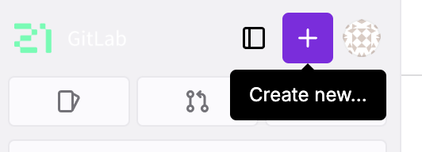
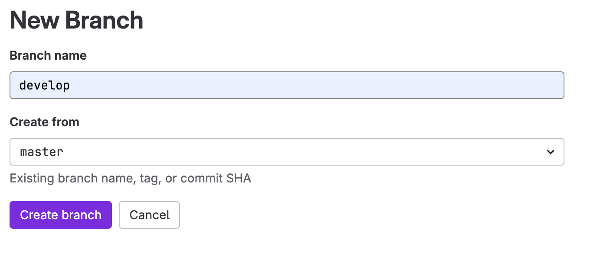
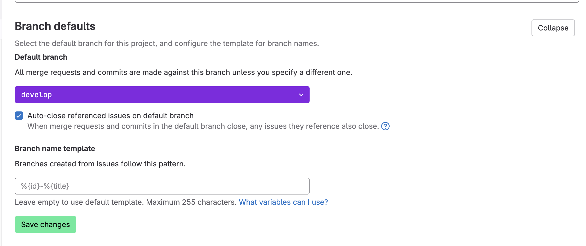
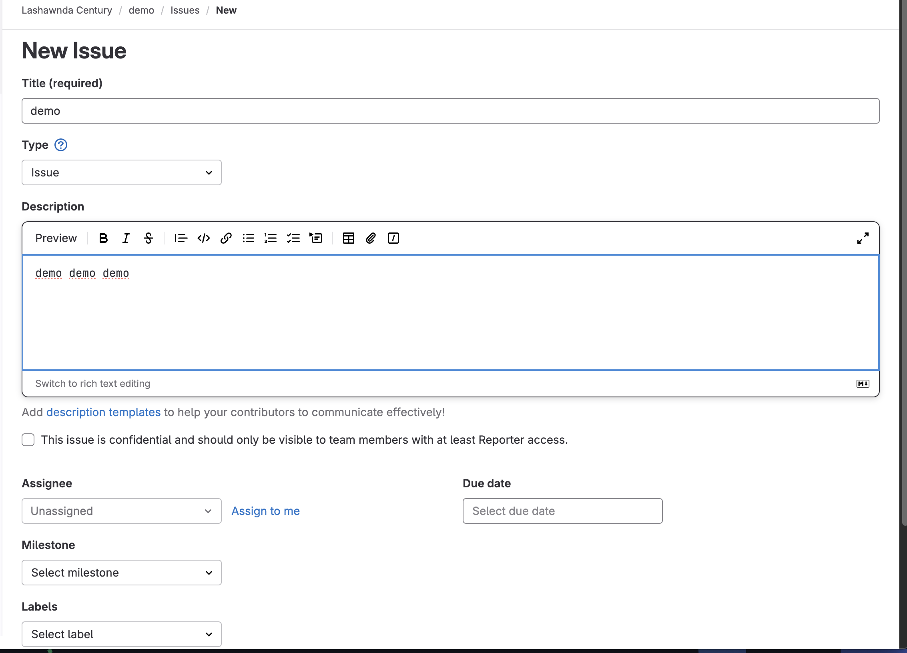
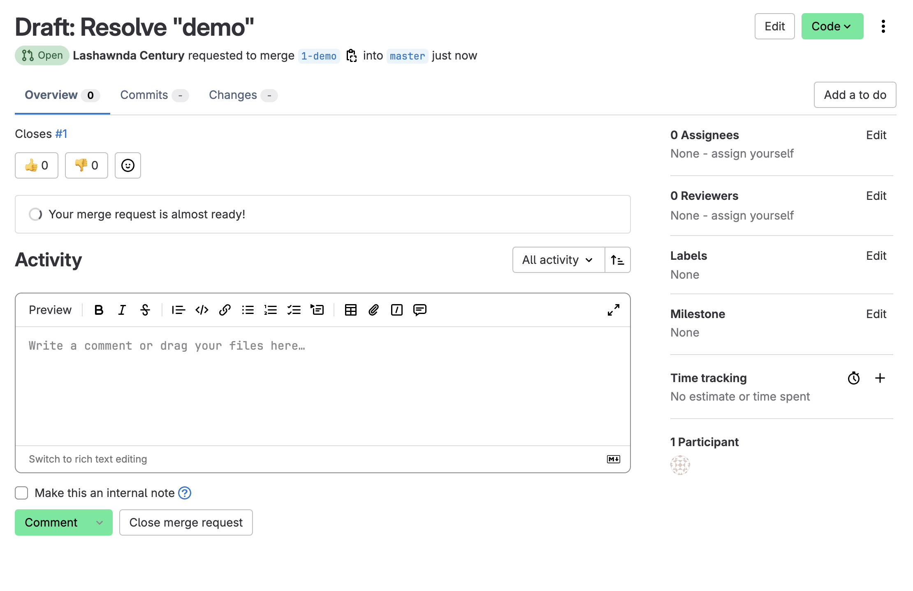
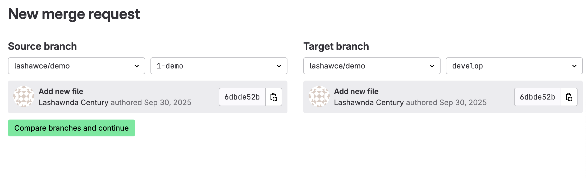

# Мануал по базовому workflow в GitLab

## 1. Создание репозитория

При создании нового проекта в GitLab можно сразу инициализировать его важными файлами.

1. На главной странице GitLab нажмите кнопку **"New project"**.
2. Заполните **"Project name"**.
3. По желанию, заполните **"Description"**.
4. Важно: Выберите видимость проекта (Private, Internal, Public).
5. **Поставьте галочку "Initialize repository with a README"**.
6. В выпадающем списке **".gitignore template"** выберите язык/технологию вашего проекта (например, `Python`). Это автоматически создаст базовый файл `.gitignore`.

---

## 2. Создание веток `master` и `develop`. Установка `develop` по умолчанию

По умолчанию GitLab создает ветку `master`. Создадим ветку `develop`.

1. В вашем проекте перейдите: **Repository > Branches**.
2. Нажмите кнопку **"New branch"**.
3. В поле **"Branch name"** введите `develop`.
4. В поле **"Create from"** выберите `master` (или `main`).
5. Нажмите **"Create branch"**.

### Установка `develop` как ветки по умолчанию

1. Перейдите в **Settings > Repository**.
2. Прокрутите до раздела **"Default branch"**.
3. Нажмите на иконку карандаша и выберите из списка ветку `develop`.
4. Нажмите **"Save changes"**.

---

## 3. Создание Issue

Issue (задача) — основная единица планирования работ.

1. В меню проекта перейдите **Issues > New issue**.
2. Заполните **Title**: "Создать мануал по GitLab workflow".
3. Заполните **Description**, при необходимости назначьте исполнителя (`Assignees`), установите метки (`Labels`).
4. Нажмите **"Create issue"**.

---

## 4. Создание ветки по Issue

Создать ветку для решения задачи можно прямо из интерфейса Issue.

1. Откройте созданную Issue.
2. В боковой панели найдите пункт **"Create merge request"** и нажмите на него.
3. GitLab предложит создать новую ветку и мерж-реквест. Заполните **"Source branch"** (имя ветки будет предложено автоматически, например, `Draft: Resolve "demo"`).
4. Нажмите **"Create merge request"**.

---

## 5. Создание Merge Request (MR)

Merge Request (MR) — запрос на слияние изменений из одной ветки в другую.

1. Если вы не создали MR из Issue, перейдите **Merge Requests > New merge request**.
2. Выберите в качестве **Source branch** вашу feature-ветку (например, `1-demo`), а в качестве **Target branch** — `develop`.
3. Нажмите **"Compare branches and continue"**.
4. Заполните заголовок и описание. В описании полезно использовать ключевое слово `Closes #1`, чтобы при принятии MR автоматически закрылась Issue #1.
5. Нажмите **"Create merge request"**.

---

## 6. Комментирование и принятие MR

Процесс код-ревью и слияния.

1. В созданном MR участники команды могут оставлять комментарии к конкретным строкам кода или общие комментарии.
2. После прохождения ревью и успешных проверок CI/CD (если они настроены) кнопка **"Merge"** станет активной.
3. Выберите стратегию слияния (например, **"Merge commit"**) и нажмите **"Merge"**.

---

## 7. Формирование стабильной версии в `master` с тегом

Когда накопится достаточно изменений в `develop` для нового релиза, нужно создать стабильную версию в `master`.

1. Создайте новый Merge Request из `develop` в `master`.
2. После его принятия и слияния, перейдите в раздел **Repository > Tags**.
3. Нажмите **"New tag"**.
4. В поле **"Tag name"** укажите версию
5. В поле **"Message"** опишите ключевые изменения релиза.
6. В поле **"Target"** убедитесь, что выбрана ветка `master`.
7. Нажмите **"Create tag"**.

---

## 8. Работа с Wiki проекта

GitLab предоставляет встроенную Wiki для документации.

1. Перейдите в **Settings > General > Visibility, project features, permissions** найти и включить **Wiki** и потом **Save changes**
2. В меню вашего проекта перейдите **Plan > Wiki > Create your first page**.
2. Заполните заголовок и содержание страницы, используя Markdown.
3. Нажмите **"Create page"**.

Wiki — это отдельный git-репозиторий. Вы можете редактировать страницы в веб-интерфейсе или локально, клонировав wiki-репо. Это идеальное место для полной, развернутой документации проекта.

